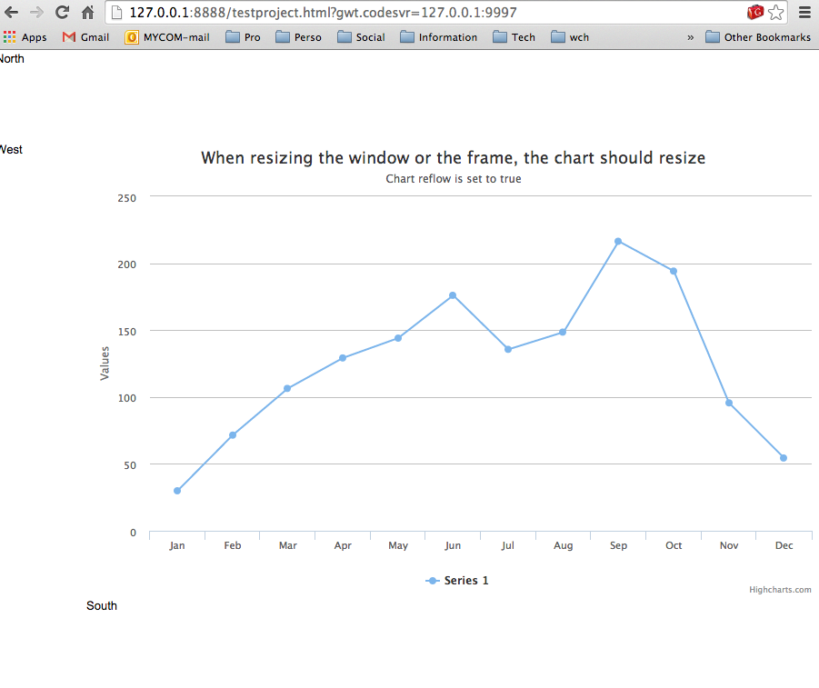

highcharts
==========

Generated GWT wrapper for highcharts API

First rendering of a chart achieved by using the generated API !!!

Lot of work to do but a big first step accomplished :)

Code Example
============

	ChartOptions options = (ChartOptions) JavaScriptObject.createObject();

	options.subtitle().text("Chart reflow is set to true");
	options.title().text("Chart reflow is set to true");

	Series series = (Series) JavaScriptObject.createObject();

	ArrayNumber data = series.data();
	data.push(29.9);
	data.push(71.5);
	data.push(106.4);
	data.push(129.2);
	data.push(144.0);
	data.push(176.0);
	data.push(135.6);
	data.push(148.5);
	data.push(216.4);
	data.push(194.1);
	data.push(95.6);
	data.push(54.4);

	options.series().addToEnd(series);

	ArrayString categories = options.xAxis().categories();
	categories.push("Jan");
	categories.push("Feb");
	categories.push("Mar");
	categories.push("Apr");
	categories.push("May");
	categories.push("Jun");
	categories.push("Jul");
	categories.push("Aug");
	categories.push("Sep");
	categories.push("Oct");
	categories.push("Nov");
	categories.push("Dec");

	container.renderChart(options);

Here is the result inside the [Test Project](https://github.com/highcharts4gwt/testproject) 

How to use it
=============

* Download the sources
* Install it in your mvn repository

		mvn clean install 

* Edit your app.gwt.xml

	<inherits name='com.usesoft.highcharts4gwt.highcharts'/>

* Edit your pom.xml 

Add the dependency
	
	<dependency>
      	<groupId>com.usesoft.highcharts4gwt</groupId>
      	<artifactId>highcharts</artifactId>
      	<version>0.0.1-SNAPSHOT</version>
    </dependency>

Add the sources to the gwt compilation

	<plugin>
        <groupId>org.codehaus.mojo</groupId>
        <artifactId>gwt-maven-plugin</artifactId>
        <version>2.6.1</version>
        <executions>
         	...
        </executions>
      
        <!-- Plugin configuration. There are many available options, see gwt-maven-plugin documentation at codehaus.org -->
        <configuration>
        	...
          	<compileSourcesArtifacts>
             	<artifact>com.usesoft.highcharts4gwt:highcharts</artifact>
          	</compileSourcesArtifacts>
        	...
        </configuration>

      </plugin>

