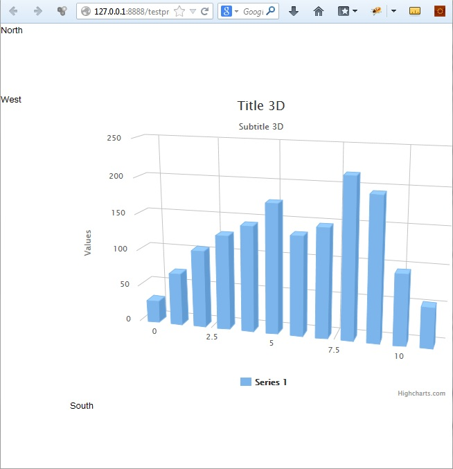

highcharts
==========

Generated GWT wrapper for highcharts API

Support almost everything now, especially 3D charts.

Still missing : support for Function / Mixed fields + other series data input format

Code Example
============

	ChartOptions options = (ChartOptions) JavaScriptObject.createObject();
     
    options.chart().type("column");
    options.chart().margin().push(75);
    options.chart().options3d().enabled(true).alpha(15).beta(15).depth(50).viewDistance(25);

    options.subtitle().text("Subtitle 3D");
    options.title().text("Title 3D");

    options.plotOptions().column().depth(25);

    Series series = (Series) JavaScriptObject.createObject();

    ArrayNumber data = series.data();
    data.push(29.9);
    data.push(71.5);
    data.push(106.4);
    data.push(129.2);
    data.push(144.0);
    data.push(176.0);
    data.push(135.6);
    data.push(148.5);
    data.push(216.4);
    data.push(194.1);
    data.push(95.6);
    data.push(54.4);

    options.series().addToEnd(series);

	container.renderChart(options);

Here is the result inside the [Test Project](https://github.com/highcharts4gwt/testproject) 

How to use it
=============

* Download the sources
* Install it in your mvn repository

		mvn clean install 

* Edit your app.gwt.xml

		<inherits name='com.usesoft.highcharts4gwt.highcharts'/>

* Edit your pom.xml 

Add the dependency
	
	<dependency>
      	<groupId>com.usesoft.highcharts4gwt</groupId>
      	<artifactId>highcharts</artifactId>
      	<version>0.0.1-SNAPSHOT</version>
    </dependency>

Add the sources to the gwt compilation

	<plugin>
        <groupId>org.codehaus.mojo</groupId>
        <artifactId>gwt-maven-plugin</artifactId>
        <version>2.6.1</version>
        <executions>
         	...
        </executions>
      
        <!-- Plugin configuration. There are many available options, see gwt-maven-plugin documentation at codehaus.org -->
        <configuration>
        	...
          	<compileSourcesArtifacts>
             	<artifact>com.usesoft.highcharts4gwt:highcharts</artifact>
          	</compileSourcesArtifacts>
        	...
        </configuration>

      </plugin>

What is still missing (not exhaustive list)
=====================================

* Improve Series API (only as array of number right now).
* Some field type (CSSObject, Colors)
* Exclusion of certain fields for certain options
* No dynamic behavior (callbacks etc.)